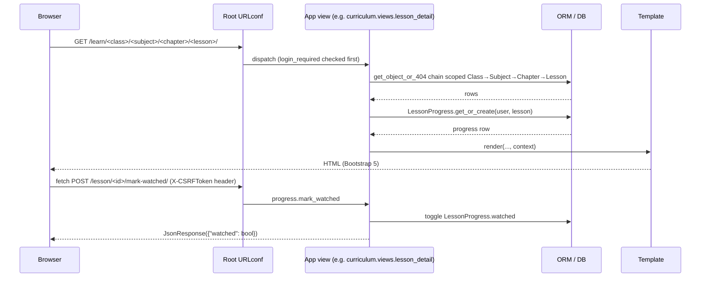
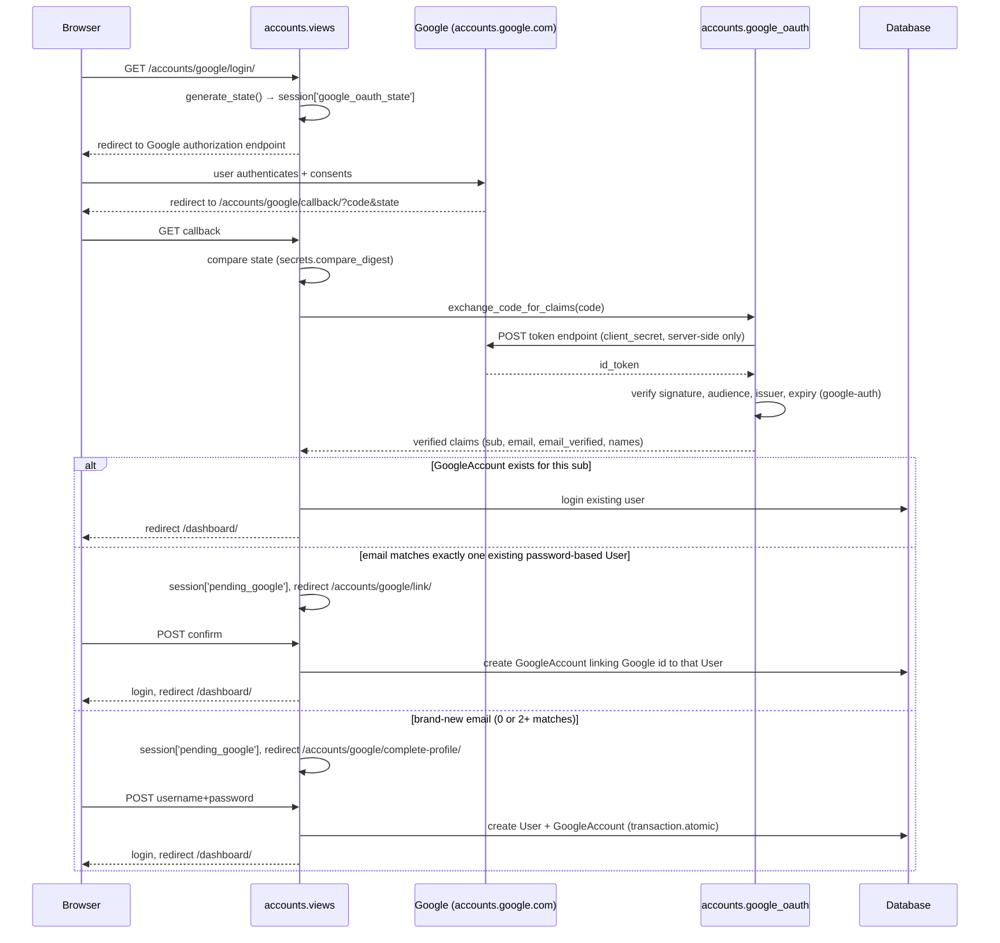
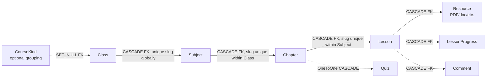
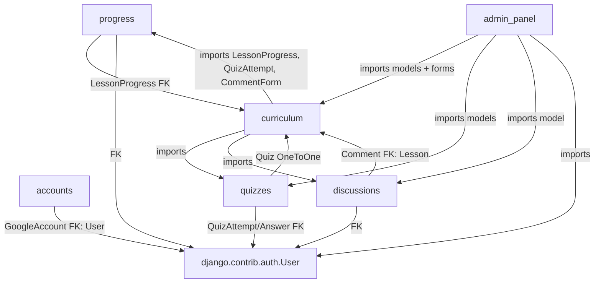

# ARCHITECTURE.md

Current implementation of EduLearn's architecture. See [AGENTS.md](AGENTS.md)
for the file map and dev rules, [DATABASE.md](DATABASE.md) for schema detail,
[API.md](API.md) for the full route table.

## High-Level Shape

A single Django project (`elearn_project`) split into seven apps, all
server-rendering HTML with Bootstrap 5. No SPA, no separate frontend build,
no REST API layer — Django views query the ORM and render templates
directly. The only exception is one JSON endpoint for the "mark as watched"
toggle.

```mermaid
graph TB
    subgraph browser[Browser]
        UI[Bootstrap 5 templates + one fetch() call]
    end

    subgraph django[Django Project: elearn_project]
        urls[Root URLconf]
        accounts[accounts<br/>auth + Google OAuth]
        curriculum[curriculum<br/>hierarchy + browsing + search]
        progress[progress<br/>watch tracking + dashboard]
        quizzes[quizzes<br/>MCQ quiz engine]
        discussions[discussions<br/>Comment model]
        admin_panel[admin_panel<br/>staff CRUD UI]
        core[core<br/>check_templates command]
    end

    db[(SQLite dev /<br/>PostgreSQL prod)]
    google[Google OAuth 2.0<br/>accounts.google.com]
    youtube[YouTube iframe embed<br/>client-side only]

    UI --> urls
    urls --> accounts
    urls --> curriculum
    urls --> progress
    urls --> quizzes
    urls --> admin_panel

    accounts --> google
    accounts --> db
    curriculum --> db
    curriculum -.uses model.-> progress
    curriculum -.uses model.-> quizzes
    curriculum -.uses form.-> discussions
    progress --> db
    quizzes --> db
    discussions --> db
    admin_panel -.CRUD over.-> curriculum
    admin_panel -.CRUD over.-> quizzes
    admin_panel -.CRUD over.-> discussions

    UI -.iframe.-> youtube
```

## App Responsibilities

| App | Models | Responsibility |
|---|---|---|
| `accounts` | `GoogleAccount` | Login/logout, Google OAuth sign-up/sign-in, account self-service (edit profile, change password, delete account). Uses Django's built-in `User`. |
| `curriculum` | `CourseKind`, `Class`, `Subject`, `Chapter`, `Lesson`, `Resource` | The admin-authored content hierarchy; student-facing browsing views; sitewide search. |
| `progress` | `LessonProgress` | Per-user watched/unwatched state; the student dashboard (streaks, resume-lesson, per-class progress); the `mark_watched` JSON endpoint. |
| `quizzes` | `Quiz`, `Question`, `Choice`, `QuizAttempt`, `QuizAnswer` | One MCQ quiz per `Chapter`; scoring; attempt history; answer review. |
| `discussions` | `Comment` | One-level-deep threaded comments per lesson (model + form only — posting logic lives in `curriculum.views.lesson_detail`). |
| `admin_panel` | *(none)* | Staff-only CRUD UI at `/panel/` over the models above, plus user management (staff/active toggles) and per-student reports. Built on Django class-based views + shared mixins in `admin_panel/mixins.py`. |
| `core` | *(none)* | Installed for one management command, `check_templates` (flags Django template tags split across lines by an HTML formatter). No models, views, or URLs. |
| `elearn_project` | — | Settings, root URLconf, WSGI entrypoint, logging setup (`logging_config.py`). |

Two independent staff surfaces exist side by side: **Django Admin**
(`/admin/`, full unrestricted model access, Django's own auth) and the
**custom panel** (`/panel/`, a curated CRUD UI gated by
`staff_member_required`, built for the specific workflows staff need day to
day). See [DECISIONS.md](DECISIONS.md) for why both exist.

## Request/Response Flow (typical student page)



## Authentication Flow

Two ways to sign in: username/password (Django's own auth) and Google OAuth.
**New account creation is Google-only** — `/register/` has no
username/email/password form.



Key properties (see [SECURITY.md](SECURITY.md) for the full list):
- `pending_google` session data is never treated as authentication by
  itself — every consumer re-validates staleness via `_pending_google_data()`
  (10-minute max age).
- `GOOGLE_OAUTH_REDIRECT_URI` is a fixed configured value, never derived
  from the incoming request's `Host` header.
- `email_verified=False` on Google's claims is rejected outright.
- 2+ existing `User` rows sharing an email is treated as unresolvable and
  falls back to new-user signup rather than guessing which to link.

For plain login, `login_view` uses Django's `AuthenticationForm` directly
and validates the `next` redirect target with
`url_has_allowed_host_and_scheme` before following it (open-redirect guard).

## Authorization Model

Three tiers, enforced per-view, not via a general permissions framework:

| Tier | Gate | Can reach |
|---|---|---|
| Anonymous | none | `/`, `/register/`, `/login/`, Google OAuth entry points |
| Authenticated (`is_active`) | `@login_required` | `/dashboard/`, `/learn/...`, `/quiz/...`, `/search/`, `/account/...` |
| Staff (`is_staff`) | `staff_member_required` / `StaffRequiredMixin` | `/panel/...`, `/admin/...` |
| Superuser (`is_superuser`) | explicit `request.user.is_superuser` check inside the view | granting/revoking `is_staff`, deactivating a staff/admin account (`admin_panel.views.user_toggle_staff` / `user_toggle_active`) |

`staff_member_required` (Django's own decorator) is used instead of a
project-defined permission — its default `login_url` is the Django Admin
login page, so an unauthenticated visit to `/panel/...` redirects to
`/admin/login/`, not `/login/`.

## Data Flow: Curriculum Hierarchy



Every level has `is_active` (hide without deleting) except `Chapter` and
`Lesson`, which have no independent visibility flag — hiding happens at the
`Class`/`Subject` level above them. `Class.slug` is globally unique;
`Subject.slug` is unique per `Class`; `Chapter.slug` is unique per `Subject`;
`Lesson.slug` is unique per `Chapter` — so every drill-down view/URL is
scoped through its full parent chain (see `curriculum.views._get_subject`
and its reuse in `quizzes.views.quiz_view`). Full field-level detail is in
[DATABASE.md](DATABASE.md).

## Dependency Relationships Between Apps



`curriculum` is the hub: `progress.models.LessonProgress` and
`quizzes.models.Quiz` both hold `ForeignKey`/`OneToOneField` references
*into* `curriculum` (via string references like `'curriculum.Lesson'` to
avoid circular imports), while `curriculum.views` imports `progress` and
`quizzes` models directly to compute watched/attempted state for chapter and
lesson pages. `admin_panel` depends on `curriculum`, `quizzes`, and
`discussions` but is depended on by nothing — it's a pure consumer.

## Important Design Decisions (see [DECISIONS.md](DECISIONS.md) for full rationale)

- Six focused apps instead of one monolithic app — despite the README's
  stale "Project Structure" section describing an older single-`core`-app
  layout.
- No custom user model — `GoogleAccount` extends stock `User` via
  `OneToOneField`.
- SQLite by default, PostgreSQL opt-in via `DATABASE_URL` — same ORM code
  either way, no backend-specific SQL anywhere.
- WhiteNoise serves static files directly from the app process — no
  nginx/CDN in front, matching a single-process Railway-style deploy.
- Server-side OAuth "authorization code" flow, not Google's client-side JS
  widget — the client secret and every verification step stay server-side.

## Architectural Constraints

- **No caching layer beyond `LocMemCache`** — it's per-process, so
  `django-ratelimit`'s counters (the only thing the cache backs) are only
  correctly shared with a single gunicorn worker. Deploying with multiple
  workers multiplies the effective rate limit by worker count unless this
  is pointed at Redis/Memcached first. See `elearn_project/settings.py`'s
  `CACHES` comment and [SECURITY.md](SECURITY.md).
- **No background job runner** (no Celery, no `django-rq`, no cron). Nothing
  in this codebase runs outside the request/response cycle.
- **No REST/JSON API surface** beyond `mark_watched` — anything resembling
  an "API" for this app is the HTML route table in [API.md](API.md).
- **Media files (`/media/...`) and rotating log files are not durable** on a
  typical ephemeral-filesystem host (e.g. Railway without a mounted
  Volume) — see [DEPLOYMENT.md](DEPLOYMENT.md).
